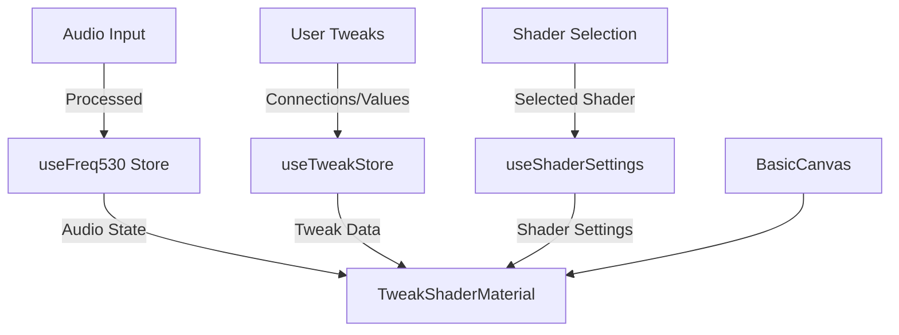
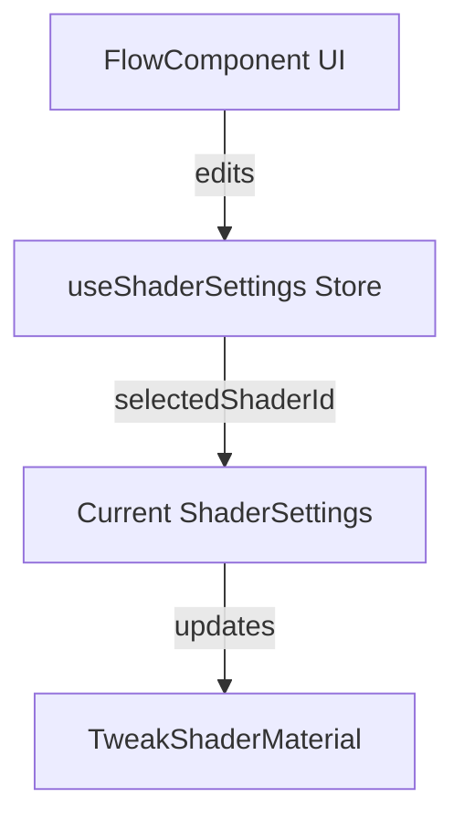

# Freq530 Visualization Ecosystem PRD

## Overview
The Freq530 visualization system is a modular, audio-reactive shader playground built with React, Zustand, and Three.js. It enables dynamic visualizations driven by real-time audio analysis and user tweakable parameters. This document explains the architecture, key components, and their interactions.

---

## System Architecture

---

## Component & Store Breakdown

### 1. [`useFreq530`](../stores/useFreq530.tsx) (Zustand Store)
- **File:** `src/Freq530/stores/useFreq530.tsx`
- **Key Types:**
  - `Freq530StateKeys` (enum)
  - `PrimaryFreq530State`, `Freq530State` (interfaces)
- **Purpose:** Central store for real-time audio analysis data and derived features (e.g., frequency bands, beat detection, amplitude, etc.).
- **Key Features:**
  - Holds all primary audio state (low, mid, high, kick, snare, etc.).
  - Provides an `update` method for audio frame updates.
  - Persists gain/average settings for user customization.
- **Consumers:**
  - `TweakShaderMaterial` (for uniforms)
  - Any UI or logic needing audio-reactive data

### 2. [`useTweakStore`](../stores/useTweakStore.tsx) (Zustand Store)
- **File:** `src/Freq530/stores/useTweakStore.tsx`
- **Key Types:**
  - `useTweakStoreState` (interface)
- **Purpose:** Manages user tweakable parameters and their connections to audio sources.
- **Key Features:**
  - `connections`: Maps tweak IDs (e.g., `right-0`) to audio state keys (e.g., `low`).
  - `tweakValues`: Manual override values for each tweak.
  - Methods to set connections and tweak values.
- **Consumers:**
  - `TweakShaderMaterial` (for dynamic uniform values)
  - UI for tweak controls

### 3. [`useShaderSettings`](../stores/useShaderSettings.tsx) (Zustand Store)
- **File:** `src/Freq530/stores/useShaderSettings.tsx`
- **Key Types:**
  - `ShaderSettings` ([see types](../shaders/types.ts))
  - `useShaderSettingsState` (interface)
- **Purpose:** Manages available shaders and the currently selected shader.
- **Key Features:**
  - `shaderSettings`: Array of available shader configurations (type: `ShaderSettings[]`).
  - `selectedShaderId`: Index of the active shader.
  - Method to set the selected shader.
- **Extensibility:**
  - Will hold a registry of all available shaders, each described by a `ShaderSettings` object.
  - Defaults can include the test shader ([see `test-shader.ts`](../canvas/test-shader.ts)).
  - **Future:** Users will be able to add, remove, and edit shader settings from external UI components, making this a dynamic, user-editable shader library.
- **Consumers:**
  - UI for shader selection
  - `TweakShaderMaterial` (to determine which shader to use)

### 4. [`test-shader.ts`](../canvas/test-shader.ts) (Shader Definition)
- **File:** `src/Freq530/canvas/test-shader.ts`
- **Key Types:**
  - `ShaderSettings`, `TweakRanges` ([see types](../shaders/types.ts))
- **Purpose:** Provides a default/test shader with tweakable parameters and their ranges.
- **Key Features:**
  - Exports vertex and fragment shader GLSL code.
  - Defines `ranges` for each tweakable uniform.
  - Used as a default in `TweakShaderMaterial` and as a template for new shaders.

### 5. [`TweakShaderMaterial`](../canvas/TweakShaderMaterial.tsx) (React Component)
- **File:** `src/Freq530/canvas/TweakShaderMaterial.tsx`
- **Props:**
  - `vertexShader?: string`
  - `fragmentShader?: string`
  - `ranges?: TweakRanges`
  - `debug?: boolean`
- **Purpose:** Renders a Three.js mesh with a custom shader, exposing tweakable uniforms driven by audio and user input.
- **Key Features:**
  - Accepts custom shaders and tweak ranges.
  - Reads audio state from `useFreq530` and tweak data from `useTweakStore`.
  - Updates shader uniforms every frame with current audio/tweak values.
  - Can be extended for debugging or custom shaders.
- **Interactions:**
  - Consumes `useFreq530` and `useTweakStore` for uniform values.
  - Receives shader code/ranges from `test-shader` or `useShaderSettings`.

### 6. [`BasicCanvas`](../canvas/BasicCanvas.tsx) (React Component)
- **File:** `src/Freq530/canvas/BasicCanvas.tsx`
- **Props:**
  - `children?: React.ReactNode`
- **Purpose:** Sets up the Three.js canvas and scene, injecting the shader material and other scene elements.
- **Key Features:**
  - Wraps the scene in a full-screen canvas.
  - Adds lights, controls, and the `TweakShaderMaterial` mesh.
  - Passes shader code/ranges to `TweakShaderMaterial`.
  - Can render children for overlays or additional 3D elements.

### 7. [`ShaderSettings`, `TweakRanges`, `TweakRange` Types
- **File:** `src/Freq530/shaders/types.ts`
- **Type Definitions:**
  - `ShaderSettings`: `{ name: string, vertexShader: string, fragmentShader: string, ranges: TweakRanges }`
  - `TweakRanges`: `[TweakRange, ... x10]` (tuple of 10 tweakable parameter configs)
  - `TweakRange`: `{ min: number, max: number, value: number, source: string | null }`

---

## Data Flow Summary

1. **Audio Input** is processed and stored in `useFreq530`.
2. **User Tweaks** are managed in `useTweakStore`, with possible connections to audio state.
3. **Shader Selection** is managed in `useShaderSettings`.
4. **TweakShaderMaterial**:
    - Reads current audio state and tweak values.
    - Updates shader uniforms accordingly.
    - Renders the visual output in the `BasicCanvas`.

---

## Example: Uniform Value Resolution

- For each tweakable uniform (e.g., `TWEAK_1`):
  1. Check if a connection exists in `useTweakStore.connections` (e.g., `right-0` → `low`).
  2. If connected, use the normalized value from `useFreq530` (e.g., `audioState.low`).
  3. If not connected, use the manual value from `useTweakStore.tweakValues`.
  4. If neither, fall back to the default in the shader's `ranges`.

---

## Extensibility
- New shaders can be added to `useShaderSettings` and selected at runtime.
- Additional tweak controls can be wired up via `useTweakStore`.
- Audio features can be expanded in `useFreq530` for richer visualizations.
- The shader registry (`useShaderSettings`) will support user-driven add/edit/remove operations in the future.

---

## Glossary
- **Tweak:** A user-adjustable parameter, possibly mapped to an audio feature.
- **Uniform:** A shader parameter updated from React state.
- **Connection:** A mapping from a tweak to an audio state key.
- **ShaderSettings:** An object containing shader code and tweak ranges.
- **TweakRanges:** An array of 10 tweakable parameter configs for a shader.

---

## Future Considerations
- UI for managing shader/tweak presets and a full shader library.
- More advanced audio feature extraction.
- Live-coding or hot-reloading shaders.
- User-driven shader creation, editing, and sharing via `useShaderSettings`.

---

## Intended Refactoring & UI/UX Roadmap

### FlowComponent as ShaderSettings Editor

**Goal:**
Empower users to visually construct and edit `ShaderSettings` using the `FlowComponent` as an interactive node-based editor.

#### Planned Features:
- **Shader Selection:**
  - On load, the first shader in the `shaderSettings` array (by id) is selected and displayed for editing.
- **Node-Based Editing:**
  - Each tweak (parameter) is represented as a node (or node property) in the flow UI.
  - Users can adjust `min`, `max`, and `source` for each tweak using left-node/right-node controls.
  - The UI will only update the store when these values are changed (debounced or on blur/commit).
- **Live Store Sync:**
  - Edits to tweak values are reflected in the `useShaderSettings` store, updating the currently selected shader's configuration.
- **Extensible UI:**
  - Future support for adding/removing tweaks, editing shader code, and managing multiple shaders.

#### Data Flow:

#### Example User Flow:
1. User opens the FlowComponent editor.
2. The first shader in `shaderSettings` is loaded for editing.
3. User selects a tweak node and adjusts its `min`, `max`, or `source`.
4. On change, the corresponding value in the store is updated.
5. The visualization updates in real time to reflect the new settings.

#### Future UI/UX Enhancements:
- Add support for creating new shaders and deleting existing ones.
- Allow editing of shader code (GLSL) directly in the UI.
- Preset management and import/export of ShaderSettings.

---

## Glossary
- **Tweak:** A user-adjustable parameter, possibly mapped to an audio feature.
- **Uniform:** A shader parameter updated from React state.
- **Connection:** A mapping from a tweak to an audio state key.
- **ShaderSettings:** An object containing shader code and tweak ranges.
- **TweakRanges:** An array of 10 tweakable parameter configs for a shader.

---

## Future Considerations
- UI for managing shader/tweak presets and a full shader library.
- More advanced audio feature extraction.
- Live-coding or hot-reloading shaders.
- User-driven shader creation, editing, and sharing via `useShaderSettings`. 